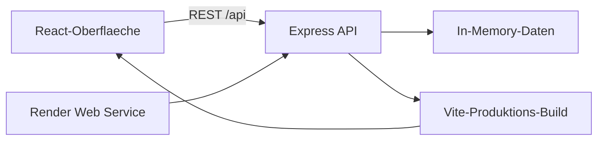
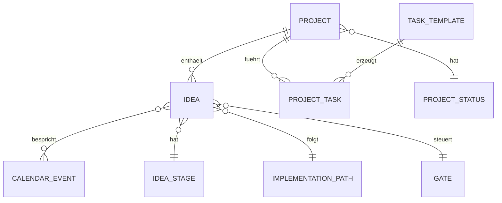

# Architektur: Project-Tool Inno V

## Zweck

Project-Tool Inno V begleitet Innovationsvorhaben nach dem InnoV-Prozess. Es trennt die operative Projektsteuerung von den fachlichen Innovationsphasen und unterstützt Projekte, Ideen, Aufgaben, Gates, Erinnerungen und Termine.

## Systemuebersicht



Die Anwendung wird als ein Node.js-Web-Service betrieben. Express liefert die REST-API und die mit Vite erzeugten statischen Frontend-Dateien aus.

## Komponenten

| Bereich | Verantwortung | Datei |
| --- | --- | --- |
| Frontend | Navigation, Projektakte, Ideenboard, Termine, Einstellungen und lokale Filterung | `src/App.tsx` |
| Frontend-Stil | Responsive, blaue Arbeitsoberflaeche | `src/App.css` |
| API | REST-Endpunkte, Validierung und In-Memory-Daten | `server/index.ts` |
| Build | TypeScript-Pruefung und Vite-Produktions-Build | `package.json` |
| Deployment | Render-Blueprint und Docker-Auslieferung | `render.yaml`, `Dockerfile` |

## Domänenmodell



### Projekt

Ein Projekt ist der Fuehrungsrahmen. Es besitzt einen konfigurierbaren primaeren Projektstatus, Fortschritt und einen naechsten Schritt. Ein Projekt kann mehrere Ideen und mehrere Aufgaben enthalten.

### Idee

Eine Idee hat einen sekundaeren Status aus dem InnoV-Prozess: `Ideate`, `Validate`, `Experiment`, `Evolve` oder `Implement`. Weitere Informationen sind Problemstellung, Ideengeber, Ideenowner, Innovations-Business-Owner, Umsetzungspfad, Gate-Entscheid und Gate-Faelligkeit.

### Aufgaben

Aufgaben sind projektbezogen und koennen eine Faelligkeit haben. Aktive Standardaufgaben werden beim Anlegen eines Projekts als eigene Projektaufgaben kopiert. Aenderungen an der Standardliste beeinflussen bereits erstellte Projekte nicht.

### Termine

Termine enthalten Datum, Uhrzeit, Ort und Typ. Ein Termin kann mehrere Ideen verknuepfen, und eine Idee darf bei mehreren Terminen vorkommen. Damit ist eine N:M-Beziehung vorbereitet.

## API

| Ressource | Endpunkte | Zweck |
| --- | --- | --- |
| Portal | `GET /api/portal` | Gesamtdaten fuer die Startansicht |
| Projekte | `GET`, `POST`, `PATCH /api/projects` | Projekte anlegen und steuern |
| Ideen | `GET`, `POST`, `PATCH /api/ideas` | Ideen und InnoV-Status pflegen |
| Benutzer | `GET`, `POST`, `PATCH /api/users` | Lokales Benutzerverzeichnis mit vorbereiteter IAM-ID |
| Aufgaben | `GET`, `POST`, `PATCH /api/tasks` | Projektaufgaben und Faelligkeiten |
| Vorlagen | `GET`, `POST`, `PATCH /api/task-templates` | Standard-Taskliste administrieren |
| Termine | `GET`, `PATCH /api/events` | Termine und Ideenverknuepfungen |
| Erinnerungen | `GET /api/reminders` | Offene Aufgaben und Gates nach Faelligkeit |
| Kataloge | `GET /api/project-statuses`, `/api/idea-stages`, `/api/gates`, `/api/implementation-paths` | Konfigurations- und Prozessdaten |
| Mail-Einstellungen | `GET`, `PATCH /api/settings/mail` | Mailhost, Port, Absender und TLS für einen späteren Versand |

Termine können aus der Oberfläche als Einladung für das lokale Mailprogramm vorbereitet werden. Der Entwurf enthält Termin, verknüpfte Projekte und Ideen. Ein SMTP- oder anderer Serverversand ist noch nicht angebunden; die Mail-Einstellungen dienen als vorbereitete Konfiguration.

Projekte und Ideen besitzen zunächst direkte `userIds`-Zuordnungen. Die Benutzerobjekte führen zusätzlich `source` und `externalId`, damit ein späterer Abgleich mit einem IAM-System die stabilen internen Zuordnungen weiterverwenden kann. Rollen und Berechtigungen sind bewusst noch nicht Bestandteil des ersten Wurfs.

## Datenhaltung

Der aktuelle Stand nutzt bewusst In-Memory-Daten. Ein Neustart der Node-Anwendung setzt alle manuellen Aenderungen zurueck. Das ist fuer die Demonstration geeignet, aber nicht fuer den Mehrbenutzerbetrieb.

Fuer die Produktion sollte die In-Memory-Schicht durch eine relationale Datenbank ersetzt werden, zum Beispiel PostgreSQL auf Render. Die bestehenden IDs und Beziehungen lassen sich direkt in Tabellen abbilden. Besonders die Ideen-Termin-Verknuepfung sollte dann als Tabelle `event_ideas` umgesetzt werden.

## Deployment

Render verwendet den Node-Web-Service oder das enthaltene Dockerfile. Der Produktionsablauf lautet:

```text
npm ci
npm run build
npm start
```

`npm run build` fuehrt die TypeScript-Pruefung und den Vite-Build aus. Der Health-Check liegt unter `/api/health`.

## Naechste Schritte

1. PostgreSQL und Persistenzschicht einfuehren.
2. Benutzer, Rollen und Berechtigungen ergaenzen.
3. Aenderungsprotokoll fuer Status-, Gate- und Aufgabenentscheidungen speichern.
4. E-Mail- oder Kalender-Erinnerungen aus den Faelligkeiten ausloesen.